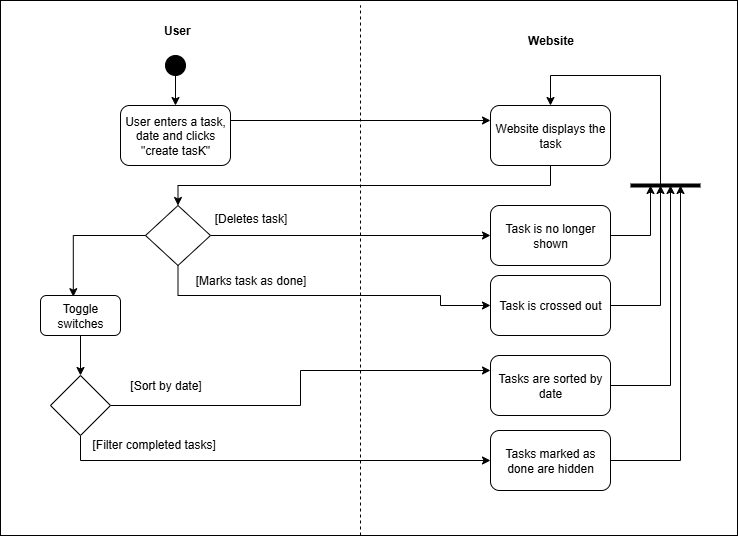
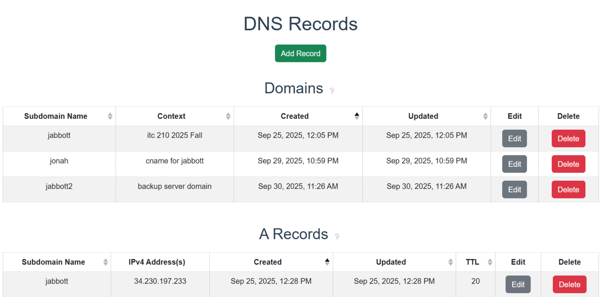

## Introduction:  
Jonah Abbott  
3 October 2025

visit the website here: https://jonahabbott1.github.io/tasklistwebsite/
## Executive Summary:

This lab involved adding functionality to a task list website using Javascript CRUD functions. This allowed for the creating and deleting of tasks, as well as being able to sort by date and filter by completion. Furthermore, the lab involved creating a DNS entry for the server hosting the website along with obtaining an SSL certificate using CertBot.

## Design Overview: 

The first part of the project was to get the site functioning through javascript CRUD functions - which stands for create, read, update, and delete. This was all done in the file `script.js`. The UML diagram below demonstrates the webpage functionality.

### UML Diagram

Once the webpage was functional, the next step was to give the server a custom domain. This required registering a domain and an A Record through a DNS service. This allowed so the website can be accessed through the url `jabbott.4hx.net` instead of having to use the public ip address. 

### DNS records

The last part was to obtain a TLS certificate for a secure https connection on the webpage. This was done using CertBot, and was configured on the linux server commandline. 

## Questions:

1. **What are two differences and similarities between JavaScript and a previous language you have used (e.g. C++ or Python)? (Think of differences and similarities that are more unique to these 2 languages, not all languages in general.)**
One difference between Javascript and Python is that Javascript is primarily used for web development while Python is often used for data science and automation. Another difference is that Python uses indentation to define code blocks instead of Javascript's curly braces.

2.  **What is the difference between JSON and JavaScript objects?**
The difference between JSON and Javascript objects is Javascript objects are actual objects in memory with data types with JSON objects are solely text.

3.  **If you open your web page in two different browsers, will changes on one appear on the other? Why or why not?**
No, changes will not appear on the other browser. This is because the web page utilizes local storage on the browser, so by using a different browser it will not have this data saved.

4.  **How long did you spend on this lab?**
I spent around 4 hours on the first part of this lab. 

5.  **What is the difference between http and https?**
The difference between http and https is traffic sent over https protocol is encrypted and secure, while data over http is not secured. 

6.  **What does the A record do in your DNS domain?**
The A record in my DNS domain connects the live server ip address to the domain.

7.  **Which key does the `certbot` tool send to Let's Encrypt to be embedded in the certificate; the public key or the private key?**
The `certbot` tool sends the public key to Let's Encrypt.

8.  **What is the TTL setting in DNS, what are the units, and what does it do?**
The TTL setting in DNS stands for "time to live", which means the time in seconds until the changes made in DNS settings are live. 

9.  **The DNS registrar tool is new this year. What did you like about it? What could we do to improve it? (Any answer gets full credit.)**
I like how simple to use the DNS registrar tool is. I also love how the 4hx domain remains open even after the semester. 

10. **How would you incorporate bash scripts in your future?**
I can incorporate bash scripts into automating server configuration, or other similar tasks.

## Lessons Learned:

### Javascript stops running after one error

I ran into the problem where only some of my javascript code was running. This was because there was a small bug at the beginning that prevented the rest of my code to by run. This was fixed by fixing the small syntax error in my code, and the rest of the javascript ran without error.

### Inability to connect to live server

There was a 404 error when trying to connect to the live server's public ip address. This was because this was after the domain was already setup. The solution was to use the domain url instead. 

### SSL certificate not being used by server

The SSL certificate was not being utilized by the server, even though it was showing up in certbot. This was because after creation, the SSL was owned by root, and not able to be used by apache2 server. This was fixed by changing ownership of the SSL to being owned by Ubuntu which fixed this issue. 

## Skills Acquired:

- Configure custom DNS records (A, CNAME, TXT) to map domains and verify ownership on a live AWS-hosted server
- Obtain and installed TLS certificates using Certbot, enabling HTTPS with automatic renewal and secure HTTP-to-HTTPS redirection
- Automate server provisioning and deployment with a Bash script, including Apache2 setup, GitHub repo integration, and SSL configuration
- Write Javascript CRUD functions for webpage functionality
- Utilize browser-side local storage

## References: 

https://jasonpearce.com/2014/08/21/create-your-own-personal-mailinator-alternate-domain/
https://www.cloudflare.com/learning/dns/dns-records/
https://letsencrypt.org/getting-started/
https://www.w3schools.com/bash/bash_script.php
